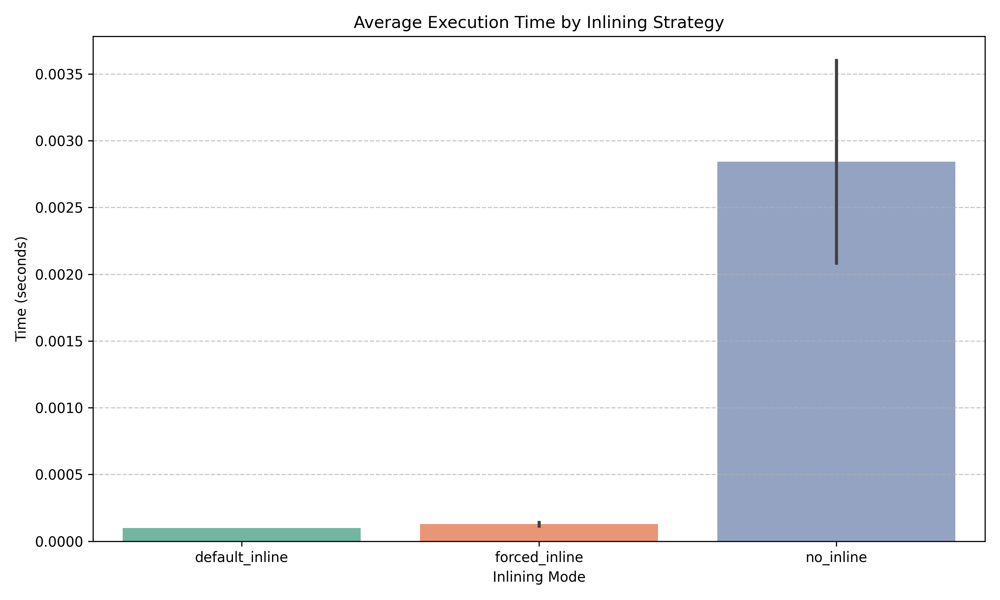

# 📁 `inlining/` – C++ Compiler Inlining Benchmark

This directory contains a benchmark experiment that measures the performance impact of C++ function inlining using compiler optimizations. It includes:

* A test harness written in C++
* CSV outputs of runtime measurements
* A Python script for visualization and statistical comparison
* A generated plot showing execution time across inlining strategies

---

## 📌 Code Structure

| File                      | Description                                                                                                                             |
| ------------------------- | --------------------------------------------------------------------------------------------------------------------------------------- |
| `code.cpp`                | C++ benchmark code calling small functions inside a tight loop. Supports forced inlining, default inlining, and no inlining via macros. |
| `analyze_inlining.py`     | Python script that reads CSV logs and generates a comparative plot (`inlining_comparison.png`) with statistics.                         |
| `default_results.csv`     | Runtime data using compiler's default inlining heuristics.                                                                              |
| `force_results.csv`       | Runtime data using `__attribute__((always_inline))`.                                                                                    |
| `noinline_results.csv`    | Runtime data using `__attribute__((noinline))`.                                                                                         |
| `inlining_comparison.png` | Bar chart visualizing the average execution time for each compilation mode.                                                             |

---

## ⚙️ Compilation & Execution

You can compile and run the benchmark in three modes:

### 🔹 1. Default Inlining (Compiler Heuristics)

```bash
g++ -O2 code.cpp -o default_inline
./default_inline 1000000 10 default_results.csv
```

### 🔹 2. Forced Inlining (`__attribute__((always_inline))`)

```bash
g++ -O2 -DFORCE_INLINE code.cpp -o force_inline
./force_inline 1000000 10 force_results.csv
```

### 🔹 3. No Inlining (`__attribute__((noinline))`)

```bash
g++ -O2 -DNO_INLINE code.cpp -o no_inline
./no_inline 1000000 10 noinline_results.csv
```

> You can change the input size (`1000000`) and the number of repetitions (`10`) as needed.

---

## 📊 Visualization

Run the Python script to analyze and compare the results:

```bash
source ../venv/bin/activate  # or use the appropriate venv path
cd inlining/
python analyze_inlining.py
```

This will:

* Load all 3 CSVs
* Compute mean/min/max/stddev execution times
* Save a bar chart to `inlining_comparison.png`
* Print a statistical summary

---

## 🖼️ Output Sample



---
