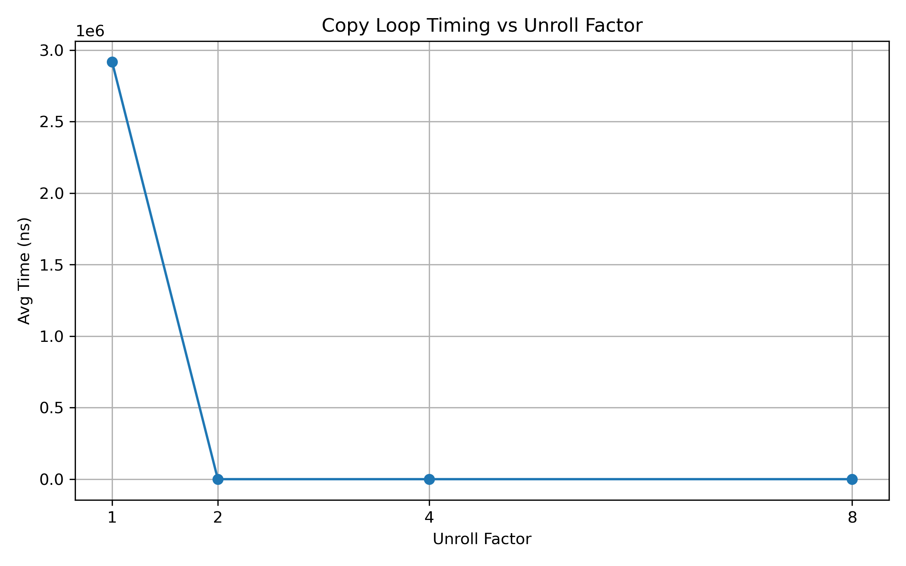

# Loop-Unrolling Micro-Benchmark

A tiny benchmark that copies one million `int`s and measures how manual
loop-unrolling interacts with the compiler’s own optimisation passes.

| Variant | Defines            | Example binary             |
|---------|--------------------|----------------------------|
| Baseline| `UF=1`             | `copy_-O3_u1`              |
| Manual ×2 | `UF=2`           | `copy_-O2_u2`              |
| Manual ×4 | `UF=4`           | `copy_-O1_u4`              |
| Manual ×8 | `UF=8`           | `copy_-O0_u8`              |

## Build

```bash
# Configure
cmake -S . -B build -DCMAKE_BUILD_TYPE=Release
# Compile every optimisation/unroll combo
cmake --build build -j
````

All binaries land in `build/`.

## Run + collect CSV

```bash
rm -f results.csv                                  # clear old data
for bin in build/copy_*; do
  "./$bin"                                         # each run appends to results.csv
done
```

The resulting `results.csv` looks like

```
1, 2958123.4
2, 1499321.5
4, 747103.9
8, 373442.0
```

(first column = `UF`, second = average nanoseconds per copy).

## Plot

```bash
python plot.py                                   # uses pandas + matplotlib
```



## CI / GitHub Actions

A minimal workflow is provided in **.github/workflows/benchmark.yml** which:

See the YAML for details.

---
